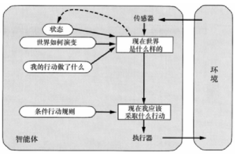
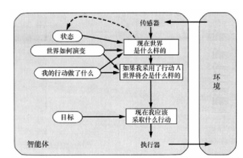

# 人工智能与机器学习

???+note "课程资源"
    === "作业资源"
       看到是国科大的作业 
       [作业](https://wenku.baidu.com/view/a008b8323a3567ec102de2bd960590c69ec3d8e1.html?_wkts_=1727330708826&needWelcomeRecommand=1) 
       [第二章作业](https://blog.csdn.net/m0_67495624/article/details/135541806) 

    === "分数构成"
        15% 随堂测试 
        20% 实验报告 
        5% 考勤 
        8% 课后作业 
        12% 小组大作业 
        40% 闭卷考试

## 绪论

### 定义

**人工智能**：Artificial Intelligence，目前是指用**计算机模拟或实现的智能**， 研究如何在机器上实现**人类智能**。即用机器来模仿人的智能。因此人工智能**又称机器智能**

**人类的自然智能**：指人在认识客观世界的过程中，由**思维过程和脑力活动**所表现出来的综合能力，如感知观察能力、记忆能力、逻辑思维能力和语言表达能力等

智能包含的能力

- 感知能力
- 记忆和思维能力
- 学习和自适应能力
- 行为能力	 
$\quad$1.含义：是人们对感知到的外界信息作出动作反应的能力 
$\quad$2.信息来源：由感知直接获得的外界信息经过思维加工后的信息。

人工智能的简单模型

详细定义：人工智能是研究人类智能活动的规律，构造具有一定智能的**人工系统**，研究如何让**计算机**去完成以往需要人的智力才能胜任的工作，也就是研究如何应用计算机的软硬件来模拟人类某些智能行为的基本理论、方法和技术。

## 智能AGENT

### AGENT的本质

#### 基本定义

智能体（Agent）：能够感知和动作的实体（任何独立的能够“思想”并可以同环境交互的实体都可以抽象为智能体）

简单说，一个智能体就是从感知序列到动作的一个函数： $f:P^* -> A$

- 感知信息：表示任何时刻Agent的感知输入。感

- 知序列：Agent收到的所有输入数据的完整历史。 
  $\quad$Agent在任何时刻的行动选择，取决于到该时刻为止的整个感知序列。 

- Agent函数：将任意给定感知序列映射到Agent的动作。可以描述Agent的行为。

#### Agent函数与Agent程序

- Agent函数：是一个抽象的数学表示
- Agent程序： 是Agent函数在某种物理体系上的具体实现

**Example**

- 世界：方格A和B
- 感知：可以感知所处的方格（位置）、是否有灰尘（本地的状态）如：[A, Dirty]
- 动作：向左移动、向右移动、吸取灰尘、什么也不做	Left, Right, Suck, NoOp
- Agent函数（感知-动作映射函数）：如果当前地点有灰尘，则吸取。否则移动到另一地点。

| **感知序列** | **行动** |
| :----------: | :------: |
|  [A, Clean]  |  Right   |
|  [A, Dirty]  |   Suck   |
|  [B, Clean]  |   Left   |
|  [B, Dirty]  |   Suck   |

### 评价Agent的行为

- 理性Agent是做事正确的智能体。 
$\quad$1.即Agent函数表格的右边都填写正确。 
$\quad$2.严谨定义：对于每一个可能的**感知序列**，根据已知的**感知序列**和内建的**先验知识**，理性Agent选择能使**性能指标**的期望值**最大化的动作**。 

- 性能度量（Agent成功程度的标准）：通常由理性Agent的设计者给出，根据实际在所处的环境中希望得到的结果来设计度量，而不是根据智能体表现的行为。	 
$\quad$ 1.把Agent置于一个环境中后，它将针对收到的感知信息产生动作序列。	 
$\quad$ 2.该动作序列引起环境历经一个状态序列。	 
$\quad$ 3.如果环境的上述状态序列是想要的，则Agent的性能良好。 

- 理性的衡量依据：PEAS 
$\quad$ 1.性能度量——performance 
$\quad$ 2.agent对环境的先验知识——environment 
$\quad$ 3. agent可以执⾏的动作——actions 
$\quad$ 4.agent的感知序列——sensor 

- 理性不完美，理性不全知
- 理性智能体要会“学习”
- 理性智能体要有“自主性”

### 任务环境

#### 性质

- 完全可观察与部分可观察 
$\quad$ 1.完全可观察：智能体能获取环境的完整状态，智能体不需要内部维护来记录世界的状况
- 确定性与随机 
$\quad$ 2.确定性：环境的下一个状态完全取决于当前状态和智能体的行动 
$\quad$ 3. 环境是确定的，除非有其它智能体活动的影响。 
- 片段式与延续式：行动的选择是否取决于当前片段
- 静态与动态 
$\quad$ 1.环境在智能体思考的时候是否会变化 
$\quad$ 2.出租车驾驶是动态的；纵横字谜游戏是静态的 
$\quad$ 3.半动态：环境本身不随时间的流逝而变化，但智能体的性能评价随时间变化；例如计时棋赛。 
- 离散与连续：智能体感知的信息和行动
- 单智能体与多智能体

**真实的世界**是部分可观，随机的，延续式的，动态的，连续的，多智能体的。

### Agent的结构

智能体 = 体系结构 + 程序

- AI的任务是设计智能体**程序**，实现把感知信息映射到行动的智能体**函数f**
- 体系结构为程序提供： 
$\quad$ 1.来自传感器的感知信息 
$\quad$ 2.运行程序 
$\quad$ 3.把程序产生的行动送到执行器  
- 所选择的程序必须适合体系结构

???+note "判断题"
    === "每个Agent函数都可以由机器/程序组合呈现"
	False。受机器的运算能力和存储能力限制。 
	=== "一个Agent函数可能对应多个Agent程序"
	True。Agent程序与运行平台关联 
	=== "实现给定Agent函数的Agent程序是否可以有多个"
	True。比如添加一些代理程序，只输入不会影响输出的空值。 
	=== "给定一个固定的机器结构，任意agent程序都会精确执行一个agent函数吗？"
	True。agent的行为被结构和程序固定。 
	
!!! note "设想我们现在保持agent程序固定，但是我们加快机器运行速度为两倍，会影响agent函数吗？"
	答:这取决于程序和环境。 如果环境是动态的，则加快机器速度可能意味着选择不同（也许更好）的动作。 如果环境是静态的，并且程序不在意运行时间，agent函数保持不变。 
	
	

### 智能体的（结构）类型

#### 分类

简单反射型：基于当前感知、忽略历史感知 

基于模型的简单反射型：使用内部模型记录世界的当前状态，按反射型决策 

基于目标型：追踪记录世界状态、要达到的目标，选择导致达成目标的行为 

基于效用型：使用更普适的度量：效用函数，把状态映射到实数来描述与智能体与状态相关的高兴程 

- 每种Agent程序都以特定的方式结合了特定的成分来生成行动
- 所有这些智能体都可以转变为学习智能体，能够提高性能以便生成更好的行动

##### 简单反射智能体

- 基于当前感知选择行动，忽略感知历史 
$\quad$ 1.基于当前感知选择行动，忽略感知历史 
$\quad$ 2.只有在可以仅根据当前感知信息来完成当前决策的情况下才能工作，即环境完全可观 

##### 具有模型的反射智能体

- 使用内部模型记录世界的当前状态，按反射型智能体方式选择行动

##### 基于目标的智能体

追踪记录世界的状态、要达到的目标，并选择导致达成目标的行动

##### 基于效用（utility）的智能体

使⽤更普适的度量：**效⽤函数**，把状态映射到实数来描述与智能体与状态相关的⾼兴程度

效用函数可以辅助进行决策：

- 有多个相互冲突的目标可达到时实现折中
- 多个目标都不能有把握达到时选择一个目标

##### 学习智能体

- 学习元件：负责改进，利用评论元件的反馈来评价智能体，并决定如何修改执行元件以将来做得更好
- 执行元件：负责选择外部动作，接受感知信息并进行行动决策
- 评论元件：根据固定的性能标准告诉学习元件智能体的运转情况如何
- 问题产生器：负责提议可以导致新的和有信息价值的经验的行动

Agent程序包含回答以下问题的部件：

- 1）当前状态；
- 2）当前应该采取的行动；
- 3）行动后果

智能体特性

- 自主性
- 反应性
- 适应性
- 社会性

### 总结

- 定义：智能体是可以感知环境并在环境中行动的某种东西。智能体函数指定智能体响应任何感知序列所采取的行动。
- 性能度量评价智能体在环境中的行为表现。理性智能体的行动使其性能度量期望值最大化。
- 任务环境包括性能度量、外部环境、执行器和传感器。设计智能体的第一步总是把任务空间定义得尽可能完全。
- 任务环境的性质：变化的，完全可观察的？确定性的？片段式的？静态的？离散的？单智能体的？
- 智能体程序是智能体函数的实现
- 简单反射型智能体直接对感知信息作出反应
- 基于模型的反射智能体保持内部状态，追踪记录当前感知信息中不明显的世界信息。
- 基于目标的智能体的行动为了达到目标
- 基于效用的智能体试图最大化自己期望的“快乐”
- 所有智能体都可以通过学习来改进其性能
