# 人工智能与机器学习

???+note "课程资源"

    === "作业资源"
       看到是国科大的作业<br>
       [作业](https://wenku.baidu.com/view/a008b8323a3567ec102de2bd960590c69ec3d8e1.html?_wkts_=1727330708826&needWelcomeRecommand=1)<br>
       [第二章作业](https://blog.csdn.net/m0_67495624/article/details/135541806)<br>
       [小测1](https://www.cc98.org/topic/5795381)<br>
       [小测2](https://www.cc98.org/topic/6006987)<br>
    
    === "分数构成"
        15% 随堂测试<br>
        20% 实验报告<br>
        5% 考勤<br>
        8% 课后作业<br>
        12% 小组大作业<br>
        40% 闭卷考试<br>
        
    === "历年小测"
        [第一次小测](./class_source/renji/1.pdf)<br>
        [第二次小测](./class_source/renji/2.pdf)<br>
        [第三次小测](./class_source/renji/3.pdf)<br>
        [第四次小测](./class_source/renji/4.pdf)<br>
        [第五次小测](./class_source/renji/5.pdf)<br>
        [第六次小测](./class_source/renji/6.pdf)<br>


## 绪论

### 定义

**人工智能**：Artificial Intelligence，目前是指用**计算机模拟或实现的智能**， 研究如何在机器上实现**人类智能**。即用机器来模仿人的智能。因此人工智能**又称机器智能**

**人类的自然智能**：指人在认识客观世界的过程中，由**思维过程和脑力活动**所表现出来的综合能力，如感知观察能力、记忆能力、逻辑思维能力和语言表达能力等

智能包含的能力

- 感知能力
- 记忆和思维能力
- 学习和自适应能力
- 行为能力	<br>
$\quad$1.含义：是人们对感知到的外界信息作出动作反应的能力<br>
$\quad$2.信息来源：由感知直接获得的外界信息经过思维加工后的信息。

人工智能的简单模型

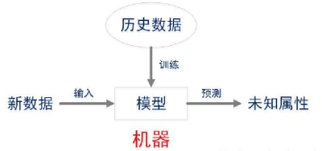

详细定义：人工智能是研究人类智能活动的规律，构造具有一定智能的**人工系统**，研究如何让**计算机**去完成以往需要人的智力才能胜任的工作，也就是研究如何应用计算机的软硬件来模拟人类某些智能行为的基本理论、方法和技术。


## 智能AGENT

### AGENT的本质

#### 基本定义

智能体（Agent）：能够感知和动作的实体（任何独立的能够“思想”并可以同环境交互的实体都可以抽象为智能体）


简单说，一个智能体就是从感知序列到动作的一个函数： $f:P^* -> A$

- 感知信息：表示任何时刻Agent的感知输入。感

- 知序列：Agent收到的所有输入数据的完整历史。<br>
  $\quad$Agent在任何时刻的行动选择，取决于到该时刻为止的整个感知序列。<br>

- Agent函数：将任意给定感知序列映射到Agent的动作。可以描述Agent的行为。

#### Agent函数与Agent程序

- Agent函数：是一个抽象的数学表示
- Agent程序： 是Agent函数在某种物理体系上的具体实现

**Example**

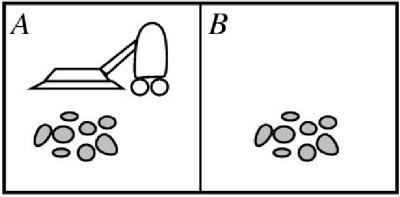

- 世界：方格A和B
- 感知：可以感知所处的方格（位置）、是否有灰尘（本地的状态）如：[A, Dirty]
- 动作：向左移动、向右移动、吸取灰尘、什么也不做	Left, Right, Suck, NoOp
- Agent函数（感知-动作映射函数）：如果当前地点有灰尘，则吸取。否则移动到另一地点。

| **感知序列** | **行动** |
| :----------: | :------: |
|  [A, Clean]  |  Right   |
|  [A, Dirty]  |   Suck   |
|  [B, Clean]  |   Left   |
|  [B, Dirty]  |   Suck   |

### 评价Agent的行为

- 理性Agent是做事正确的智能体。<br>
$\quad$1.即Agent函数表格的右边都填写正确。<br>
$\quad$2.严谨定义：对于每一个可能的**感知序列**，根据已知的**感知序列**和内建的**先验知识**，理性Agent选择能使**性能指标**的期望值**最大化的动作**。<br>

- 性能度量（Agent成功程度的标准）：通常由理性Agent的设计者给出，根据实际在所处的环境中希望得到的结果来设计度量，而不是根据智能体表现的行为。	<br>
$\quad$ 1.把Agent置于一个环境中后，它将针对收到的感知信息产生动作序列。	<br>
$\quad$ 2.该动作序列引起环境历经一个状态序列。	<br>
$\quad$ 3.如果环境的上述状态序列是想要的，则Agent的性能良好。<br>

- 理性的衡量依据：PEAS<br>
$\quad$ 1.性能度量——performance<br>
$\quad$ 2.agent对环境的先验知识——environment<br>
$\quad$ 3. agent可以执⾏的动作——actions<br>
$\quad$ 4.agent的感知序列——sensor<br>

- 理性不完美，理性不全知
- 理性智能体要会“学习”
- 理性智能体要有“自主性”

### 任务环境

#### 性质

- 完全可观察与部分可观察<br>
$\quad$ 1.完全可观察：智能体能获取环境的完整状态，智能体不需要内部维护来记录世界的状况
- 确定性与随机<br>
$\quad$ 2.确定性：环境的下一个状态完全取决于当前状态和智能体的行动<br>
$\quad$ 3. 环境是确定的，除非有其它智能体活动的影响。<br>
- 片段式与延续式：行动的选择是否取决于当前片段
- 静态与动态<br>
$\quad$ 1.环境在智能体思考的时候是否会变化<br>
$\quad$ 2.出租车驾驶是动态的；纵横字谜游戏是静态的<br>
$\quad$ 3.半动态：环境本身不随时间的流逝而变化，但智能体的性能评价随时间变化；例如计时棋赛。<br>
- 离散与连续：智能体感知的信息和行动
- 单智能体与多智能体

**真实的世界**是部分可观，随机的，延续式的，动态的，连续的，多智能体的。


### Agent的结构

智能体 = 体系结构 + 程序

- AI的任务是设计智能体**程序**，实现把感知信息映射到行动的智能体**函数f**
- 体系结构为程序提供：<br>
$\quad$ 1.来自传感器的感知信息<br>
$\quad$ 2.运行程序<br>
$\quad$ 3.把程序产生的行动送到执行器 <br>
- 所选择的程序必须适合体系结构

???+note "判断题"
    === "每个Agent函数都可以由机器/程序组合呈现"
	False。受机器的运算能力和存储能力限制。<br>
	=== "一个Agent函数可能对应多个Agent程序"
	True。Agent程序与运行平台关联<br>
	=== "实现给定Agent函数的Agent程序是否可以有多个"
	True。比如添加一些代理程序，只输入不会影响输出的空值。<br>
	=== "给定一个固定的机器结构，任意agent程序都会精确执行一个agent函数吗？"
	True。agent的行为被结构和程序固定。<br>
	
!!! note "设想我们现在保持agent程序固定，但是我们加快机器运行速度为两倍，会影响agent函数吗？"
	答:这取决于程序和环境。 如果环境是动态的，则加快机器速度可能意味着选择不同（也许更好）的动作。 如果环境是静态的，并且程序不在意运行时间，agent函数保持不变。<br>
	
	

### 智能体的（结构）类型

#### 分类

简单反射型：基于当前感知、忽略历史感知<br>

基于模型的简单反射型：使用内部模型记录世界的当前状态，按反射型决策<br>

基于目标型：追踪记录世界状态、要达到的目标，选择导致达成目标的行为<br>

基于效用型：使用更普适的度量：效用函数，把状态映射到实数来描述与智能体与状态相关的高兴程<br>


- 每种Agent程序都以特定的方式结合了特定的成分来生成行动
- 所有这些智能体都可以转变为学习智能体，能够提高性能以便生成更好的行动


##### 简单反射智能体

- 基于当前感知选择行动，忽略感知历史<br>
$\quad$ 1.基于当前感知选择行动，忽略感知历史<br>
$\quad$ 2.只有在可以仅根据当前感知信息来完成当前决策的情况下才能工作，即环境完全可观<br>

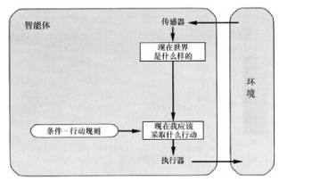

##### 具有模型的反射智能体

- 使用内部模型记录世界的当前状态，按反射型智能体方式选择行动


##### 基于目标的智能体

追踪记录世界的状态、要达到的目标，并选择导致达成目标的行动


##### 基于效用（utility）的智能体

使⽤更普适的度量：**效⽤函数**，把状态映射到实数来描述与智能体与状态相关的⾼兴程度

效用函数可以辅助进行决策：

- 有多个相互冲突的目标可达到时实现折中
- 多个目标都不能有把握达到时选择一个目标

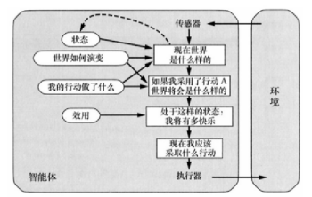

##### 学习智能体

- 学习元件：负责改进，利用评论元件的反馈来评价智能体，并决定如何修改执行元件以将来做得更好
- 执行元件：负责选择外部动作，接受感知信息并进行行动决策
- 评论元件：根据固定的性能标准告诉学习元件智能体的运转情况如何
- 问题产生器：负责提议可以导致新的和有信息价值的经验的行动

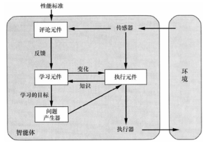

Agent程序包含回答以下问题的部件：

- 1）当前状态；
- 2）当前应该采取的行动；
- 3）行动后果


智能体特性

- 自主性
- 反应性
- 适应性
- 社会性


### 总结

- 定义：智能体是可以感知环境并在环境中行动的某种东西。智能体函数指定智能体响应任何感知序列所采取的行动。
- 性能度量评价智能体在环境中的行为表现。理性智能体的行动使其性能度量期望值最大化。
- 任务环境包括性能度量、外部环境、执行器和传感器。设计智能体的第一步总是把任务空间定义得尽可能完全。
- 任务环境的性质：变化的，完全可观察的？确定性的？片段式的？静态的？离散的？单智能体的？
- 智能体程序是智能体函数的实现
- 简单反射型智能体直接对感知信息作出反应
- 基于模型的反射智能体保持内部状态，追踪记录当前感知信息中不明显的世界信息。
- 基于目标的智能体的行动为了达到目标
- 基于效用的智能体试图最大化自己期望的“快乐”
- 所有智能体都可以通过学习来改进其性能


## 通过搜索进行问题求解

### 搜索算法

#### 深度优先（DFS）

队列：先进后出


#### 广度优先（BFS）

是**没有权重**的Dijkstra算法

队列：先进先出

[广度优先搜索算法（BFS）](https://blog.csdn.net/aliyonghang/article/details/128724989)

图示：

A为起点，G为终点。一开始我们在起点A上，此时并不知道G在哪里。

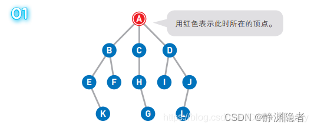

将可以从A直达的三个顶点B、C、D设为下一步的候补顶点。

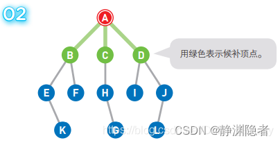

从候补顶点中选出一个顶点。优先选择最早成为候补的那个顶点，如果多个顶点同时成为候补，那么可以随意选择其中一个。

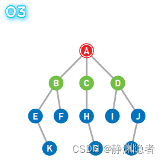

假设选择B点为先进去的，此时的队列[B C D]变为[C D]

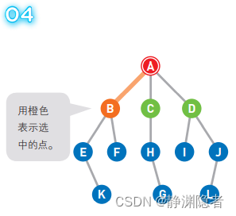

移动到选中的顶点B上。此时我们在B上， 所以B变为红色，同时将已经搜索过的顶点变为橙色。

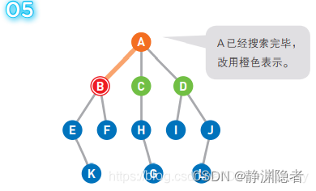


将可以从B直达的两个顶点E和F设为候补顶点并加入队列，变为[C D E F]

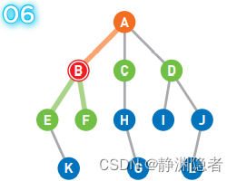

此时，最早成为候补顶点的是C和D，我们选择了左边的顶点C。

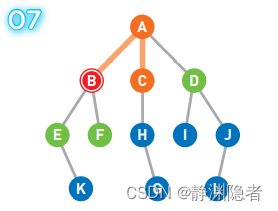

移动到选中的顶点C上。


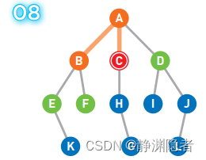

将可以从C直达的顶点H设为候补顶点，并将C移除队列，此时的队列[D E F H]。 

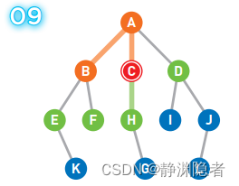

重复上述操作直到到达终点，或者所有的顶点都被遍历为止。 


#### Dijkstra算法

[B站视频]([https://www.bilibili.com/video/BV1zz4y1m7Nq/?spm_id_from=333.337.search-card.all.click&vd_source=ace17a48ec1787387c4c8d582e6808cb)

- 每次从未标记的节点中选取距离出发点最近的节点，标记，收录到最优路径集合中
- 计算刚加入节点A的邻近节点B的距离，若A的距离+A到B的距离小于B的距离，则更新B的距离

例题如下

首先用表格记录该店距离前面点的初始距离，起始的值都为无穷大，前面点都为空


首先节点0到0，距离为0，找到距离最小的值，为0，加入已搜索节点，并标注前面点为0

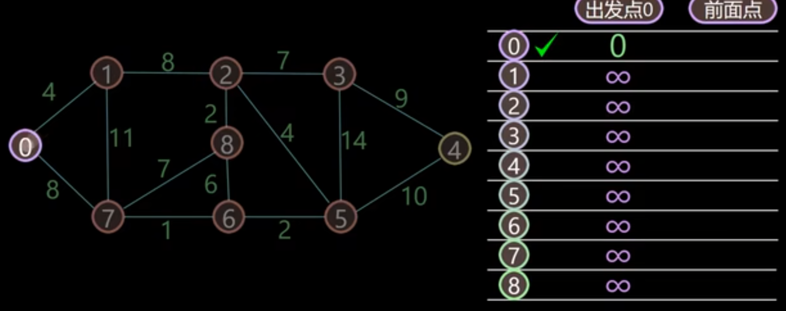

更新节点0附件的节点1和7的距离

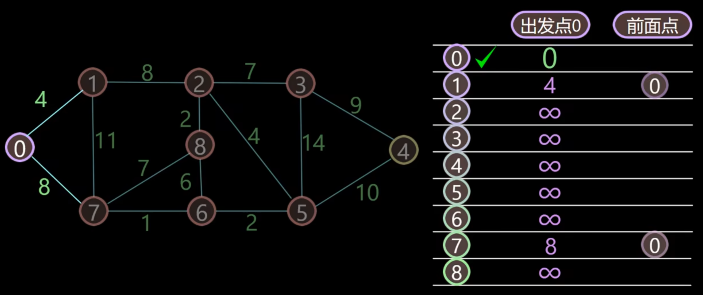

在未被加入已搜索节点的里面找到距离出发点最小的点，是1点，将其加入已搜索点，并跟新1节点周围的点的距离。

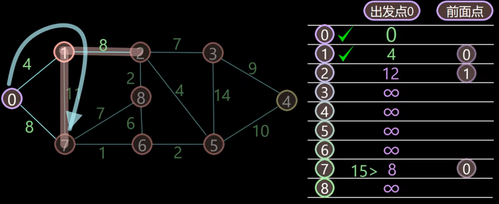

依次类推，直到所有点都被搜索完成

**优点**: 

- **准确性**: 总是能找到最短路径。
- **简单性**: 实现相对简单。

**缺点**: 

- **效率较低**: 算法需要遍历图中的大多数节点，可能导致较高的计算成本。
- **实时性差**: 在动态环境中可能不适用，因为它不能快速适应环境的变化


### 启发式搜索

#### 最好优先算法

将⼀致代价搜索（每次取路径耗散g(n)最小的拓展）的代价换成对希望值评估函数f(n)的评估，每次搜索时优先扩展最有希望的未扩展节点（评估值最小的节点）。

**g(n)**：从起始点到当前点n的实际耗散

**h(n)**：从当前点n到目标点的最小路径耗散估计

​		如果h(n)从不高估到达目标的最低路径耗散值，称h(n)是可容纳的，即h(n)永远小于当前点到目标的实际最小耗散。

**f(n)**：从起始点经过当前点n到达目标点的路径最小耗散估计


目标节点的h(n)=0，其实现：堆栈是一个按照期望递减顺序排列的队列。

#### A*算法

与Dijkstra的区别：是加了猜测H函数的Dijkstra算法

- Dijkstra: G(n)
- A*:F(n)=G(n)+H(n)

[A*讲解](https://blog.csdn.net/Zhouzi_heng/article/details/115035298)

#####  搜索区域(The Search Area)

以题目进行解释，我们假设某人要从 A 点移动到 B 点，但是这两点之间被一堵墙隔开。如图 1 ，绿色是 A ，红色是 B ，中间蓝色是墙。


格子的状态分为可走 (walkalbe) 和不可走 (unwalkable)

##### 开始搜索(Starting the Search)

- 从起点 A 开始，并把它就加入到一个由方格组成的 open list( 开放列表 ) 中。 Open list 里的格子是路径可能会是沿途经过的，也有可能不经过。基本上 open list 是一个**待检查**的方格列表。
- 查看与起点 A 相邻的方格 ( 忽略其中unwalk的方格 ) ，把其中可走的 (walkable) 或可到达的 (reachable) 方格也加入到 open list 中。把起点 A 设置为这些方格的父亲 (parent node 或 parent square) 。
- 把 A 从 open list 中移除，加入到 close list( 封闭列表 ) 中， close list 中的每个方格都是现在不需要再关注的。

如下图所示，深绿色的方格为起点，它的外框是亮蓝色，表示该方格被加入到了 close list 。与它相邻的黑色方格是需要被检查的，他们的外框是亮绿色。每个黑方格都有一个灰色的指针指向他们的父节点，这里是起点 A 。


##### 路径排序(Path Sorting)

对每个节点，在计算时同时考虑两项**代价**指标：**当前节点与起始点的距离**，以及**当前节点与目标点的距离**：F = G + H

- **欧式距离**：G = 从起点 A 移动到指定方格的移动代价，沿着到达该方格而生成的路径。
  - $G = \sqrt{(x_1 - x_2)^2 +(y_1 - y_2)^2}$ 
- **曼哈顿距离**：H = 从指定的方格移动到终点 B 的估算成本。
  - $H = |x_1 - x_2| + |y_1 - y_2|$
  - 注意，H函数的选取要满足**估算成本小于实际成本**

计算起始点相邻方格的F、G、H的值，分别记录在左上角，左下角和右下角


##### 继续搜索(Continuing the Search)

为了继续搜索，我们从 open list 中选择 F 值最小的 ( 方格 ) 节点，然后对所选择的方格作如下操作：

- 把它从 open list 里取出，放到 close list 中。
- 检查所有与它相邻的方格，忽略其中在 close list 中或是不可走 (unwalkable) 的方格 ( 比如墙，水，或是其他非法地形 ) ，如果方格不在open lsit 中，则把它们加入到 open list 中。把我们选定的方格设置为这些新加入的方格的父亲。
  - 然后计算新加入的方格相对于当前处理方格的F、G、H值(注意G为累加值)
  - 选取其中F值最小的作为下一个待处理的方格。
  - 然后继续上面的操作。
- 如果某个相邻的**所有方格**均已经在 open list 中，则检查所有方格所在的这条路径是否更优，也就是说经由当前方格 ( 我们选中的方格 ) 到达那个方格是否具有更小的 G 值。
  - 如果没有，不做任何操作。
  - 相反，如果 G 值更小，则把那个方格的父亲设为当前方格 ( 我们选中的方格 ) ，然后重新计算那个方格的 F 值和 G 值。


1. 对于上图，在我们最初的 9 个方格中，还有 8 个在 open list 中，起点被放入了 close list 中。在这些方格中，起点右边的格子的 **F 值 40 最小**，因此我们选择这个方格作为下一个要处理的方格。它的外框用蓝线打亮。

2. 首先，我们把它从 open list 移到 close list 中  。然后我们检查与它相邻的方格。它右边的方格是墙壁，我们忽略。它左边的方格是起点，在 close list 中，我们也忽略。其他 4 个**相邻的方格均在 open list 中**，因此我们需要检查经由这个方格到达那里的路径是否更好，使用 G 值来判定。让我们看看上面的方格。它现在的 G 值为 14 。如果我们经由当前方格到达那里， G 值将会为 20。显然 20 比 14 大，因此这不是最优的路径。

3. 当把 4 个已经在 open list 中的相邻方格都检查后，**没有发现经由当前方格的更好路径**，因此我们不做任何改变。现在我们已经检查了当前方格的所有相邻的方格，并也对他们作了处理，是时候选择下一个待处理的方格了。

4. 因此再次遍历我们的 open list ，现在它只有 7 个方格了，我们需要选择 F 值最小的那个。有趣的是，这次有两个方格的 F 值都 54 ，选哪个呢？没什么关系。**从速度上考虑，选择最后加入 open list 的方格更快**。

5. 我们选择起点右下方的方格，如下图所示

   

6. 只有三个方格可以选取，当前处理方格左边的方格，以及新加入的两个方格中。我们检查经由当前方格到达那里是否具有更小的 G 值。没有。因此我们准备从 open list 中选择下一个待处理的方格。

7. 以此类推，找到最短路径


相关代码如下

```python
def heuristic(a: GridLocation, b: GridLocation) -> float:
    (x1, y1) = a
    (x2, y2) = b
    return abs(x1 - x2) + abs(y1 - y2)

def a_star_search(graph: WeightedGraph, start: Location, goal: Location):
    frontier = PriorityQueue()
    frontier.put(start, 0)
    came_from: dict[Location, Optional[Location]] = {}
    cost_so_far: dict[Location, float] = {}
    came_from[start] = None
    cost_so_far[start] = 0
    
    while not frontier.empty():
        current: Location = frontier.get()
        
        if current == goal:
            break
        
        for next in graph.neighbors(current):
            new_cost = cost_so_far[current] + graph.cost(current, next)
            if next not in cost_so_far or new_cost < cost_so_far[next]:
                cost_so_far[next] = new_cost
                priority = new_cost + heuristic(next, goal)
                frontier.put(next, priority)
                came_from[next] = current
    
    return came_from, cost_so_far

from implementation import *
start, goal = (1, 4), (8, 3)
came_from, cost_so_far = a_star_search(diagram4, start, goal)
draw_grid(diagram4, point_to=came_from, start=start, goal=goal)
print()
draw_grid(diagram4, path=reconstruct_path(came_from, start=start, goal=goal))
```


### 局部搜索

#### 爬山法


#### 模拟退火


#### 遗传算法


### 对抗搜索（博弈）

- 在一个竞争的环境中，智能体之间通过竞争实现相反的利益，一方利益最大化，另一方最小化。

**博弈的定义**：通过初始状态、每个状态的合法行动、终止测试和可用在终止状态的效用函数定义。

**博弈类型**：完全信息博弈，不完全信息博弈，概率博弈。

**博弈问题形式化**：初始状态、后继函数、终止测试、效用函数

#### MINMAX算法


#### $\alpha-\beta剪枝 $


**截断搜索（不完整的实时决策）**：α-β剪枝依然要搜索至少一部分空间直到终止状态，这样的搜索不现实。用可以估计棋局效用的启发式评估函数EVAL代替效用函数，用是否到达截断处测试取代终止测试。

- **评估函数**：计算简单；对非终止状态，评估函数应该和取胜的实际机会（几率）密切相关；评估函数对终止状态的排序与实际的效用函数相同。

  国际象棋中EVAL通常取为加权线性函数：$\sum_{i=1}^{n}w_if_i(s)$

**概率博弈**：期望极小极大策略，通过计算全部子节点的平均效用来评价一个机会节点。时间复杂度为$O(b^mn^m)$，其中n为不同的掷骰子结果的数目。

对于概率博弈使用类似α-β剪枝：限制效用函数的取值范围，不用看机会节点的子节点就可以设置机会节点的值的上界。通过扩展极小极大值算法来处理，扩展后的算法其全部节点的平均效用来评价一个机会节点，平均效用值是每个节点的概率加权平均值。

**不完全信息博弈**：对每种牌局计算每个行为的最小最大值，然后选择对所有牌局期望值最高的行为。如果某个行为对所有的牌局都是最优的，则它是最优的。


## 知识、推理与规划

### 逻辑智能体

**推理**：AI的核心问题是推理，即研究怎样使计算机获得自动推理的能力

- 概念：按照某种策略从**已知事实**出发去推出**结论**的过程
- 方法：

1. **演绎推理**：从已知的一般性知识出发，去推出蕴含在这些已知知识中的适合于某种个别情况的结论；一种**由一般到个别**的推理方法，核心是三段论。不能增加新知识。
2. **归纳推理**：**由个别到一般**；可分为枚举、类比、统计、差异归纳推理等。是增加新知识的过程。
3. **类比归纳推理**：是指在两个或两类事物有许多属性都相同或相似的基础上，推出它们在其他属性上也相同或相似的一种归纳推理。

控制策略：指如何使用领域知识使推理过程尽快达到目标的策略

- 推理策略：主要解决推理方向、冲突消解等问题


1. 推理方向控制策略：可分为正向推理、逆向推理、混合推理及双向推理

2. 求解策略：仅求一个解，还是求所有解或最优解等

3. 限制策略：对推理的深度、宽度、时间、空间等进行的限制

4. 冲突消解策略：指当有多条知识可用时，如何从多条可用知识中选出一条最佳知识用于推理的策略

- 搜索策略

**逻辑智能体**：基于知识的智能体，采用推理过程来得到关于新世界的表示，并用这些新表示推导下一步做什么。从通用的形式表达的知识中获益，通过对信息的组合和再组合，以适应各种用途。

**在部分可观察的环境**，能够将常识和当前的感知结合起来，在选择行动之前推导出当前状态的隐藏部分。

**自然语言理解**：要对隐含状态即说话者的意图进行推理。

**基于知识的智能体（KBA）**：核心构件是其知识库。用感知信息作为输入，并返回一个行动。

- 知识库：一个语句（用知识表示语言表达，表示了关于世界的某些断言）集合，是用于信息系统中的结构化或非结构化数据的大型存储库。

  两类：Curated KBs（从维基百科和WordNet等知识库中抽取大量的实体及实体关系，可以理解为是一种结构化的维基百科）；Extracted KBs（直接从上亿个网页中抽取实体关系三元组），实体关系和实体更多的是自然语言的形式，但是可能会存在一定噪音，其精确度要低于Curated KBs

  Tell：将新语句添加到知识库

  Ask：查询目前所知内容；当Ask知识库一个问题时，答案必须遵循（follow）事先被告知的知识库的内容。

- 知识库问答：给定自然语言问题，通过对问题进行语义理解和解析，利用知识库进行查询、推理得出答案。

- 基于知识的智能体必须能够：表达状态，动作等；合并新的感知；更新内部对世界的表达；演绎世界的隐藏特性；演绎合适的动作。

**逻辑**：用来表达信息的形式语言

- 语法：定义语言中的语句怎样的表达是合法的

  语义：定义语句的“意思”。在标准逻辑中，语义定义了每条语句关于每种可能世界的真值，非真即假。

- **蕴涵**：“如果…则…”，即一件事为真可得出另一件事也为真。

  α╞ β（语句α蕴涵语句β）⇔ 使α为真的每个模型中，β也为真

  KB ╞ α  (知识库KB蕴涵语句α) ⇔ 在KB为真的所有模型中α也为真

  1. **逻辑等价**：任意两个语句α和β是等价的当且仅当它们互相蕴涵时。α ⇔ β iff α╞ β and β╞ α

**命题逻辑**：

- **命题**：具有真假意义的陈述性语句。
- 特点：陈述性、上下文无关、无歧义性、合成性。
- 命题语言：是命题逻辑使用的形式语言，是符号的集合，用$Lp$表示。
- **原子公式（文字）**：命题语言中的一个表达式是原子公式，当且仅当它是一个命题符号。
- **原子语句**：单个命题词组成，每个命题词代表一个真或假的命题
- **复合句**：原子语句和逻辑连接词构造而成（优先级次序从高到低如下顺序）
- 

### 一阶逻辑
