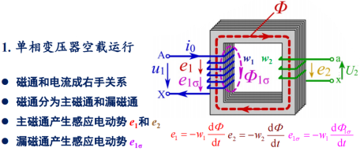
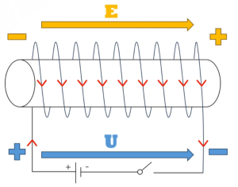
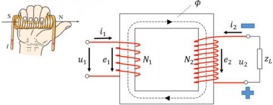

# 电气控制技术

## 电机学

### 变压器

#### 分类

- 相数：单相、三相
- 绕组：双绕组、三绕组、多绕组、自耦
- 冷却方式：油浸式、干式
- 铁心结构 ：芯式、壳式

#### 基本结构（非重点）

- 结构：铁心；高、低压两套绕组
- 铁芯：叠片式、渐开线式
  - 其中，叠片式又分芯式和壳式

#### 额定值

- 额定容量：$S_N$（视在功率VA）
  - **原边、副边的额定容量相等**
- 额定电压：原边$U_{1N}$,副边$U_{2N}$
  - **副边额定电压$U_{2N}$是变压器原边外加额定电压$U_{1N}$时副边的空载电压**
  - **三相变压器，额定电压指线电压**
- 额定电流：原边$I_{1N}$,副边$I_{2N}$
  - **单相变压器：** $I_{1N} = \frac{S_N}{U_{1N}}  \quad I_{2N} = \frac{S_N}{U_{2N}}$
  - **三相变压器：** $I_{1N} = \frac{S_N}{\sqrt{3}U_{1N}} \quad I_{2N} = \frac{S_N}{\sqrt{3}U_{2N}}$
- 额定频率：**$f_N = 50Hz$**

#### 基本工作原理

- 若磁通按正弦规律变化，即 $\Phi = \Phi_msin\omega t \quad e_1 = -w_1 \omega \Phi_m cos\omega t = 2 \pi fw_1 \Phi_m sin(\omega t -90^0)$
- 用向量表示有$ \dot{E_1}  = -j\sqrt{2} fw_1 \dot{ \Phi}_m $
- 同理有$ \dot{E_2}  = -j \sqrt{2} fw_2 \dot{ \Phi}_m $
- 变压器变比$k = \frac{E_1}{E_2}=\frac{w_1}{w_2} \simeq  \frac{U_{1N}}{U_{2N}}$

#### U和E正方向的判定

[变压器U&E方向标注_哔哩哔哩_bilibili](https://www.bilibili.com/video/BV1bj411x7VN/?spm_id_from=333.337.search-card.all.click&vd_source=ace17a48ec1787387c4c8d582e6808cb)

首先考虑一个简单的通电螺线管，将通电的螺线管看作一个电源，电源内部电流从负极流向正级，因此E和U的方向如下图所示

原边的方向与上述通电螺线管判断一致。再根据右手定则判断磁通的方向，如图$\phi$所示，再根据右手螺旋定则判断副边电流$i_2$的方向，再根据上面的方法判断E和U的方向。

