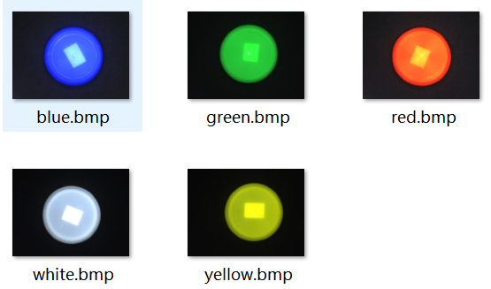

# 自动化竞赛实训

## 机器视觉

### 瓶盖颜色检测

- 图片HSV提取

```python
import cv2
import numpy as np
from matplotlib import pyplot as plt

image=cv2.imread('../picture/white.bmp')
HSV=cv2.cvtColor(image,cv2.COLOR_BGR2HSV)
def getpos(event,x,y,flags,param):
    if event==cv2.EVENT_LBUTTONDOWN: #定义一个鼠标左键按下去的事件
        print(HSV[y,x])

cv2.imshow("imageHSV",HSV)
cv2.imshow('image',image)
cv2.setMouseCallback("imageHSV",getpos)
cv2.waitKey(0)

```

运行之后，会出现 `png`和`hsv`两个图片，点击`hsv`的位置即可提取该点的值，然后获得该图片的颜色范围

- 颜色识别代码

  ```python
  import cv2
  import numpy as np
  import os
  
  # 定义颜色范围的字典，使用HSV颜色空间表示
  # 利用get_hsv.py获取图片的CSV范围（仅适用于本次lab，图中的white很像blue）
  COLOR_RANGES = {
      'red': [(0, 100, 100), (10, 255, 255)],
      'green': [(60, 190, 150), (70, 220, 255)],
      'blue': [(90, 100, 250), (125, 230, 255)],
      'yellow': [(30, 226, 187), (35, 238, 255)],
      'white':[(0,0,0),(110,80,255)]
  }
  
  # 定义函数来检测瓶盖颜色
  def detect_cap_color(image):
      # 将图片从BGR转换为HSV颜色空间
      hsv = cv2.cvtColor(image, cv2.COLOR_BGR2HSV)
      
      for color, (lower_range, upper_range) in COLOR_RANGES.items():
          # 转换为numpy数组，定义颜色范围
          lower_bound = np.array(lower_range)
          upper_bound = np.array(upper_range)
  
          # 创建遮罩，过滤出特定颜色范围的区域
          mask = cv2.inRange(hsv, lower_bound, upper_bound)
  
          # 计算遮罩中非零像素的数量，如果大于某个阈值，说明检测到了该颜色
          if cv2.countNonZero(mask) > 0:
              return color
      return 'Unknown'
  
  # 读取指定目录下的所有BMP图像并进行颜色检测
  def process_images(directory):
      for filename in os.listdir(directory):
          if filename.endswith(".bmp"):
              # 读取图像
              image_path = os.path.join(directory, filename)
              image = cv2.imread(image_path)
  
              # 检测颜色
              color = detect_cap_color(image)
  
              # 输出结果
              print(f"Image {filename}: Detected cap color is {color}")
  
  # 使用示例
  image_directory = '../picture'  # 替换为你的BMP图片集的路径
  process_images(image_directory)
  
  ```

  使用图片
  
  
  
  运行结果如下


## Modbus

### Modbus主从机通信

从机要求

- 2路离散量输入（按键代替）
- 2路开关量控制，用LED模拟
- 一路模拟量输入，用电位器模拟（输入寄存器）
- 一路模拟量输出，用LED进行PWM调光（保持寄存器）

接线如下图


- 编辑器：Arduino
- 调用库：ModbusRTUSlave

具体代码如下

```C++
#include <ModbusRTUSlave.h>

const byte keyPins[2] = {4, 5};
const byte ledPins[3] = {2, 3, 7};
const byte potPin = A8;
const byte dePin = 13;

bool coils[2];
bool discreteInputs[2];
uint16_t holdingRegisters[1] = {0};
uint16_t inputRegisters[1] = {0};

ModbusRTUSlave modbus(Serial2, dePin);

void setup()
{
  Serial.begin(115200);
  Serial2.begin(115200);

  pinMode(keyPins[0], INPUT_PULLUP);
  pinMode(keyPins[1], INPUT_PULLUP);
  pinMode(ledPins[0], OUTPUT);
  pinMode(ledPins[1], OUTPUT);
  pinMode(ledPins[2], OUTPUT);
  pinMode(potPin, INPUT);

  
  modbus.configureCoils(coils, 2);                       
  modbus.configureDiscreteInputs(discreteInputs, 2);     
  modbus.configureHoldingRegisters(holdingRegisters, 1); 
  modbus.configureInputRegisters(inputRegisters, 1);     

  modbus.begin(1, 115200);
}

void loop()
{
  modbus.poll();

  discreteInputs[0] = digitalRead(keyPins[0]); //按键未按下，discreteInputs = 0；按键按下，discreteInputs = 1
  discreteInputs[1] = digitalRead(keyPins[1]);

  // Serial.print("Key 1: ");
  // Serial.println(digitalRead(keyPins[0]));
  // Serial.print("Key 2: ");
  // Serial.println(digitalRead(keyPins[1]));

  inputRegisters[0] = analogRead(potPin);
  //控制 LED(线圈状态)
  digitalWrite(ledPins[0], coils[0] ? HIGH : LOW);//根据线圈状态控制 LED
  // digitalWrite(ledPins[0], 1);//根据线圈状态控制 LED
  // Serial.print("coils[0]: ");
  // Serial.print(coils[0]);
  // Serial.print(" ");
  // Serial.print("coils[1]: ");
  // Serial.print(coils[1]);
  // Serial.print("\n");
  
  digitalWrite(ledPins[1], coils[1] ? HIGH : LOW);//根据线圈状态控制 LED
  //控制模拟量输出(LED PWM 调光)
  analogWrite(ledPins[2],holdingRegisters[0]);//根据保持寄存器的值调节 LED 亮度
}


```

