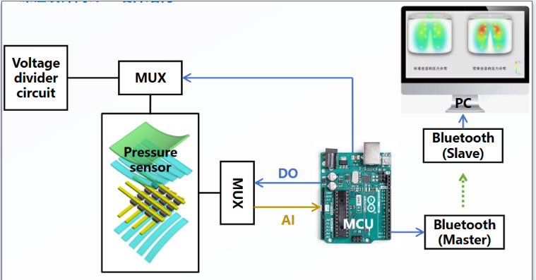

# 智能电子设备开发

???+note "课程资源"


    === "分数组成"
        10%平时+10%读书报告+10%思政报告+30%设计作业+40%实物制作<br>


    === "柔性器材——大作业参考资料"
        [MUX](https://blog.csdn.net/weixin_44345862/article/details/108326490?ops_request_misc=&request_id=&biz_id=102&utm_term=arduino%20%E5%A4%9A%E8%B7%AF%E5%A4%8D%E7%94%A8%E4%BE%8B%E7%A8%8B&utm_medium=distribute.pc_search_result.none-task-blog-2~all~sobaiduweb~default-0-108326490.142^v96^pc_search_result_base3&spm=1018.2226.3001.4187)<br>
        [HC-05蓝牙模块](https://blog.csdn.net/qq_42250136/article/details/115962544?ops_request_misc=&request_id=&biz_id=102&utm_term=hc05&utm_medium=distribute.pc_search_result.none-task-blog-2~all~sobaiduweb~default-1-115962544.nonecase&spm=1018.2226.3001.4187)<br>
        [HC05-Arduino连接](https://blog.csdn.net/catzhaojia/article/details/119243058?ops_request_misc=%257B%2522request%255Fid%2522%253A%2522169802660916800186593395%2522%252C%2522scm%2522%253A%252220140713.130102334..%2522%257D&request_id=169802660916800186593395&biz_id=0&utm_medium=distribute.pc_search_result.none-task-blog-2~all~sobaiduend~default-2-119243058-null-null.142^v96^pc_search_result_base3&utm_term=arduino%20bluetooth%20&spm=1018.2226.3001.4187)<br>
        [pybluz模块](https://blog.csdn.net/weixin_50396804/article/details/109823229?ops_request_misc=%257B%2522request%255Fid%2522%253A%2522169802539816777224449711%2522%252C%2522scm%2522%253A%252220140713.130102334..%2522%257D&request_id=169802539816777224449711&biz_id=0&utm_medium=distribute.pc_search_result.none-task-blog-2~all~sobaiduend~default-4-109823229-null-null.142^v96^pc_search_result_base3&utm_term=python%20bluetooth&spm=1018.2226.3001.4187)<br>
## 大作业——柔性材料传感器

### 原理

利用压敏电阻片受到压力会产生形变导致电阻发生变化，因此其两端的电压值会发生变化，利用Arduino的ADC口测量其电压值。通过两个MUX可以控制阵列不同地方的导通，因此可以依次读取阵列所有点的压力值。

### 硬件部分

|      材料       | 数量 |
| :-------------: | :--: |
| MUX多通道复用器 |  2   |
|    HC-05模块    |  2   |
|     Arduino     |  1   |
|     USB-TTL     |  1   |
|    LM358功放    |  2   |
|     面包板      |  1   |

制作一个2x2阵列的传感器进行数据读取

- 将压敏导电片进行裁剪，将其剪成1cm*1cm的小方块；
-  拿出铜箔胶带，裁剪成宽度为0.5cm左右的宽度；
-  利用提供的塑封带，将铜箔胶带贴在塑封袋的两边，使得与压敏导电片接触并将电流引出来；
-  制作成一个简单的2X2的阵列，以便后面实验进行。


连接如下图所示



### 软件配置

#### 蓝牙模块配置

关于从机与主机与蓝牙的连接方式

**从机**

| HC-05 | USB-TTL |
| :---: | :-----: |
|  VCC  |   5V    |
|  GND  |   GND   |
|  TXD  |   RXD   |
|  RXD  |   TXD   |

**主机（与Arduino练级）**

| HC-05 | Arduino |
| :---: | :-----: |
| STATE |  不连   |
|  RXD  |  pni11  |
|  TXD  |  pin10  |
|  GND  |   GND   |
|  VCC  |   5V    |
|  EN   |  不连   |

关于主从机蓝牙连接的配置

```C++
# 从机配置
AT              # 测试指令，响应：OK
AT+ORGL         # 恢复默认设置，响应：OK
AT+ROLE=0       # 将模块设置成从机模式，响应：OK
AT+ADDR?        # 获取模块蓝牙地址
AT+PSWD=1122    # 设置配对码为1122

# 主机配置
AT              # 测试指令，响应：OK
AT+ORGL         # 恢复默认设置，响应：OK
AT+ROLE=1       # 将模块设置成主机模式，响应：OK
AT+PSWD=1122    # 设置配对码为1122
AT+CMODE=0      # 设置为指定蓝牙地址连接模式
AT+BIND=xx      # 绑定蓝牙地址,xx为上面从机获得的地址
```

##### 测试代码

###### Arduino代码

通过Arduino的串口监视器可以发送信息，电脑端可以收到

```C++
#include <SoftwareSerial.h> 
// Pin10接HC05的TXD
// Pin1接HC05的RXD
SoftwareSerial BT(10, 11); 
char val;
 
void setup() {
  Serial.begin(38400); 
  Serial.println("bluetooth is ready!");
  BT.begin(38400);
}
 
void loop() {
  if (Serial.available()) {
    val = Serial.read();
    BT.print(val);
  }
 
  if (BT.available()) {
    val = BT.read();
    Serial.print(val);
  }
}
```

###### PC端代码

```python
import serial

# 配置串口的参数
port = 'COMX'  # 替换为你的实际串口
baudrate = 38400  # 波特率，根据实际设备的配置
timeout = 1  # 设置超时时间，单位为秒

# 初始化串口
try:
    ser = serial.Serial(port, baudrate, timeout=timeout)
    print(f"已连接到 {port}")
except serial.SerialException as e:
    print(f"无法打开串口: {e}")
    exit()

# 持续读取串口数据并打印
try:
    while True:
        if ser.in_waiting > 0:  # 检查是否有数据可读取
            data = ser.readline()#.decode('utf-8').strip()  # 读取一行并去掉末尾的换行符
            print(f"接收到的数据: {data}")
except KeyboardInterrupt:
    print("程序终止")

# 关闭串口
finally:
    ser.close()
    print("串口已关闭")
```

这样就可以验证通讯是否能够进行，接下来就可以进行MUX控制开关实现电压的读取了

#### MUX

读取示例代码

```C++
int s0 = 8;
int s1 = 9;
int s2 = 10;
int s3 = 11;

//Mux in “SIG” pin
int SIG_pin = 0;

void setup(){
pinMode(s0, OUTPUT);
pinMode(s1, OUTPUT);
pinMode(s2, OUTPUT);
pinMode(s3, OUTPUT);

digitalWrite(s0, LOW);
digitalWrite(s1, LOW);
digitalWrite(s2, LOW);
digitalWrite(s3, LOW);

Serial.begin(9600);
}

void loop(){
    //Loop through and read all 16 values
    //Reports back Value at channel 6 is: 346
    for(int i = 0; i < 16; i ++){ 
        Serial.print("Value at channel ");
        Serial.print(i); Serial.print("is : ");
        Serial.println(readMux(i));
        delay(1000);
    }
}
int readMux(int channel){ 
    int controlPin[] = {s0, s1, s2, s3};
	int muxChannel[16][4]={ {0,0,0,0}, //channel 0
        {1,0,0,0}, //channel 1
        {0,1,0,0}, //channel 2
        {1,1,0,0}, //channel 3
        {0,0,1,0}, //channel 4
        {1,0,1,0}, //channel 5
        {0,1,1,0}, //channel 6
        {1,1,1,0}, //channel 7
        {0,0,0,1}, //channel 8
        {1,0,0,1}, //channel 9
        {0,1,0,1}, //channel 10
        {1,1,0,1}, //channel 11
        {0,0,1,1}, //channel 12
        {1,0,1,1}, //channel 13
        {0,1,1,1}, //channel 14
        {1,1,1,1} //channel 15
    }; //loop through the 4 sig
    for(int i = 0; i < 4; i ++){ 
        //read the value at the SIG pin
        digitalWrite(controlPin[i], muxChannel[channel][i]); 
    } 
    int val = analogRead(SIG_pin);
   //return the value
	return val; 
}
```


### 实际代码

#### Arduino

```

```


#### PC

```

```

